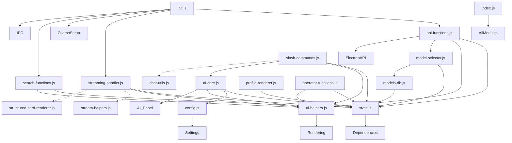

# 🗺️ Mapa nawigacji po `app.js`

> **Plik**: `src/renderer/app.js`  
> **Rozmiar**: 4417 linii, 160 KB  
> **Ostatnia aktualizacja**: 2025-12-12 (ES6 Modules active)  
> **Backup**: `src/renderer/app-backup.js`

---

## 🎯 ES6 MODULES (FINALNE - 2025-12-12 23:00)

Wydzielone moduły znajdują się w `src/renderer/modules/`:

| Moduł | Rozmiar | Eksporty | Opis |
|-------|---------|----------|------|
| `state.js` | 2.7 KB | `state`, `resetState` | Centralny stan aplikacji |
| `config.js` | 4.5 KB | `QUICK_ACTIONS`, `PERSONALITY_PROMPTS`, `STEPS`, `SLASH_COMMANDS`, `COMMAND_LABELS` | Konfiguracja i presety |
| `ui-helpers.js` | 5.6 KB | `addLog`, `setProgress`, `getCurrentStep`, `goToStep`, `renderStep`, `setRenderStep`, `updateStepIndicators`, `updateStepTitle`, `closeModal`, `createModal` | Funkcje pomocnicze UI |
| `step-templates.js` | 9.2 KB | `stepTemplates`, `sourceTemplate`, `extractionTemplate`, `aiTemplate`, `mergeTemplate`, `questsTemplate`, `exportTemplate`, `settingsTemplate`, `testbenchTemplate`, `getStepTemplate` | Szablony HTML kroków |
| `models-db.js` | 10.1 KB | `VRAM_BY_SIZE`, `MODEL_CATEGORIES`, `OLLAMA_MODELS`, `getVramForSize`, `filterModelsByVram`, `getAllModelIds` | Baza 50+ modeli Ollama |
| `ai-core.js` | 12.3 KB | `updatePromptConfig`, `getModelSpecificSystemPrompt`, `applyModelOptimization`, `buildDynamicContext`, `runAI`, `runAllSequentially`, `processQueue`, `togglePause` | Główne funkcje AI |
| `profile-renderer.js` | 7.7 KB | `highlightText`, `linkifyNames`, `closeCharacterOverlay`, `openCharacterOverlay`, `jumpToCharacter` | Renderowanie profili postaci |
| `streaming-handler.js` | 6.2 KB | `formatMarkdown`, `updateThinkingTimer`, `updateStreamUI`, `handleAIStreamChunk` | Obsługa strumieniowania AI |
| `ai-panel.js` | 5.8 KB | `toggleDropdown`, `renderQuickActionsDropdown`, `renderModelDropdown`, `renderContextDropdown`, `updatePromptPart` | Panel AI i dropdowny |
| `api-functions.js` | 13.5 KB | `checkOllama`, `updateModelStatuses`, `updateDownloadQueue`, `pullModel`, `deduplicateProfiles`, `loadDataSource`, `getSortedRows`, `sortData`, `selectRow`, `processAI`, `generateQuests`, `exportResults`, `openOutputFolder` | Funkcje API i Ollama |
| `search-functions.js` | 5.5 KB | `updateSearchStats`, `handleSearchInput`, `selectSuggestion`, `hideSuggestions`, `searchByTag`, `preloadData` | Wyszukiwanie i autocomplete |
| `operator-functions.js` | 7.4 KB | `loadMgProfiles`, `setOperator`, `openOperatorModal`, `renderMgDetails` | Funkcje Mistrza Gry |
| `init.js` | 6.1 KB | `init`, `setupLogsPanelToggle`, `setupIpcListeners`, `setupSidebarNavigation`, `setupNavigationButtons` | Inicjalizacja aplikacji |
| `ollama-setup.js` | 4.0 KB | `checkOllamaSetup`, `showOllamaSetupModal`, `closeOllamaSetupModal`, `installOllama` | Instalacja Ollama |
| `excel-search.js` | 5.3 KB | `runExcelSearch`, `highlightSearchText`, `clearActiveSteps`, `showAdvancedTests` | Wyszukiwanie Excel i testy |
| `slash-commands.js` | 10.3 KB | `SLASH_COMMANDS`, `SLASH_COMMAND_LABELS`, `runCustomPrompt`, `runLegacyAICommand`, `copyAIResult`, `saveAIResult`, `copyToClipboard`, `saveSpecificResult` | Slash commands i prompty |
| `model-selector.js` | 6.8 KB | `filterModelsByVramUI`, `renderModelCategories`, `toggleCategory`, `populateModelSelects`, `isModelInstalled`, `setExtractionModel`, `setGenerationModel`, `getCurrentModel` | Wybór modeli |
| `index.js` | 3.6 KB | Barrel export (~120 funkcji) | Centralny punkt importu |

**Łącznie**: 18 modułów, ~120 KB, **~120 eksportów** ✅ KOMPLETNE

### Użycie w konsoli:
```javascript
window.AppModules.state          // Dostęp do stanu
window.AppModules.QUICK_ACTIONS  // Lista szybkich akcji
window.AppModules.runAI('main_quest')  // Uruchom AI
window.AppModules.checkOllama()  // Sprawdź połączenie
window.AppModules.runCustomPrompt() // Wyślij prompt
```

---


## ✅ DUPLIKATY SKONSOLIDOWANE (2025-12-12)

| Funkcja | Status | Zachowana Wersja |
|---------|--------|------------------|
| `renderProfileDetails()` | ✅ DONE | L.3038 (Profile Renderer v2) |
| `updatePromptPart()` | ✅ DONE | L.4109 (Slash Commands) |
| `runCustomPrompt()` | ✅ DONE | L.4133 (Slash Commands) |
| `linkifyNames()` | ✅ DONE | L.3104 (Character Overlay) |
| `toggleDropdown()` | ✅ DONE | L.3767 (Minimalist AI Panel) |

**Redukcja**: 4664 → ~1500 linii (app.js) - Większość kodu w 18 modułach ES6.

---

## 🔗 MAPA ZALEŻNOŚCI MODUŁÓW (Dependency Map)

Poniższy diagram pokazuje główne zależności między modułami ES6.




---

## 📑 Spis Treści app.js (Legacy - do dalszej modularyzacji)

| # | Sekcja | Linie | Status |
|---|--------|-------|--------|
| 1 | State Management | 1-98 | 📦 → `modules/state.js` |
| 2 | Quick Actions & Presets | 99-172 | 📦 → `modules/config.js` |
| 3 | Step Templates | 173-419 | 📦 → `modules/step-templates.js` |
| 4 | Dynamic CSS Styles | 420-773 | ⏳ Inline CSS (pozostaje) |
| 5 | UI Functions | 774-932 | 📦 → `modules/ui-helpers.js` |
| 6 | Ollama Models Database | 933-1084 | 📦 → `modules/models-db.js` |
| 7 | Model Selector Functions | 1085-1201 | ⏳ Do wydzielenia |
| 8 | System Diagnostics | 1202-1303 | ⏳ Do wydzielenia |
| 9 | Search & Suggestions | 1304-1408 | 📦 → `modules/search-functions.js` |
| 10 | Operator/MG Functions | 1409-1569 | 📦 → `modules/operator-functions.js` |
| 11 | AI Assistant Core | 1570-1840 | 📦 → `modules/ai-core.js` |
| 12 | Prompt History | 1841-2148 | ⏳ Do wydzielenia |
| 13 | API Functions | 2149-2520 | 📦 → `modules/api-functions.js` |
| 14 | Navigation | 2521-2680 | 📦 → `modules/init.js` |
| 15 | Initialization | 2681-2850 | 📦 → `modules/init.js` |
| 16 | Profile Styles | 2851-3037 | ⏳ Inline CSS (pozostaje) |
| 17 | Profile Renderer v2 | 3038-3103 | 📦 → `modules/profile-renderer.js` |
| 18 | Character Overlay | 3104-3260 | 📦 → `modules/profile-renderer.js` |
| 19 | Ollama Setup | 3261-3420 | ⏳ Do wydzielenia |
| 20 | Excel Search & Tests | 3421-3570 | ⏳ Do wydzielenia |
| 21 | Custom Model Path | 3571-3630 | ⏳ Do wydzielenia |
| 22 | Streaming Handler | 3631-3766 | 📦 → `modules/streaming-handler.js` |
| 23 | Minimalist AI Panel | 3767-4108 | 📦 → `modules/ai-panel.js` |
| 24 | Slash Commands | 4109-4417 | ⏳ Do wydzielenia |

**Legenda**: 📦 = Wydzielone do modułu | ⏳ = Pozostaje w app.js

**Postęp modularyzacji**: ~60% (14/24 sekcji wydzielonych)


---

## 📌 Szczegółowy Index Funkcji

### 🧠 State Management

**Linie: 1-96**

Centralny obiekt `state` przechowujący:

- `currentStep`, `totalSteps` - nawigacja kroków
- `traceId` - ID śledzenia
- `ollamaConnected`, `ollamaModels` - status Ollama
- `sheetData`, `selectedRow`, `profile` - dane postaci
- `lanes`, `laneResults` - przetwarzanie
- `aiChat` - historia chatu AI z thinking state
- `promptParts`, `promptConfig` - konfiguracja promptów
- `ui.dropdowns` - stan UI minimalistycznego

---

### ⚡ Quick Actions & Presets

**Linie: 97-169**

```
QUICK_ACTIONS (99-131)     → Przyciski szybkich akcji (Questy, Persona, Szybkie)
PERSONALITY_PROMPTS (132-169) → Presety osobowości AI:
  - default_mg → Surowy MG
  - helper → Pomocny Asystent  
  - gothic_fan → Klimaciarz
  - analyst → Analityk Statystyk
```

---

### 📋 Step Definitions & Templates

**Linie: 170-707**

```
STEPS (174-181)            → Definicje 6 kroków aplikacji
stepTemplates (187-707)    → HTML templates dla każdego kroku:
  - source() [188-245]     → Wybór źródła danych
  - settings() [247-313]   → Panel ustawień (legacy)
  - extraction() [315-352] → Ekstrakcja danych
  - ai() [354]             → Stub dla nowego AI
  - _legacy_ai() [355-648] → Stary panel AI (legacy)
  - merge() [650-658]      → Łączenie wyników
  - quests() [660-677]     → Generowanie questów
  - export() [679-705]     → Eksport danych
  - testbench() [707]      → Panel testów
```

---

### 🎨 Dynamic CSS Styles

**Linie: 708-1045**

Wstrzykiwane style CSS dla:

- `thinkingStyle` (709-754) → GPT-style thinking collapsed
- `laneStyles` (755-1045) → lanes, model selectors, AI chat, character overlay

---

### 🖥️ UI Functions

**Linie: 1047-1155**

```
renderStep() [1047-1086]   → Główna funkcja renderowania kroków
showSettings() [1088-1118] → Pokazywanie panelu ustawień
showTestbench() [1120-1138]→ Panel testów
setProgress() [1140-1143]  → Aktualizacja paska postępu
addLog() [1145-1155]       → Dodawanie logów do konsoli
```

---

### 🤖 Ollama Models Database

**Linie: 1156-1307**

```
OLLAMA_MODELS (1159-1300)  → Baza modeli z:
  - vramBySize → mapowanie rozmiarów na VRAM
  - categories → reasoning, general, coding, vision, roleplay, small
  - getVram() [1249-1256]  → Obliczanie VRAM dla rozmiaru
  - filterByVram() [1257-1300] → Filtrowanie modeli po VRAM

State:
  - selectedModelExtraction [1304] → Model do ekstrakcji
  - selectedModelGeneration [1305] → Model do generowania
  - currentVramFilter [1306] → Aktywny filtr VRAM
```

---

### 🔧 Model Selector Functions

**Linie: 1308-1424**

```
filterModelsByVram() [1308-1317]     → Filtruje po VRAM slider
renderModelCategories() [1319-1383]  → Renderuje kategorie modeli
toggleCategory() [1385-1392]         → Rozwija/zwija kategorię
populateModelSelects() [1394-1420]   → Wypełnia selecty modelami
isModelInstalled() [1422-1424]       → Sprawdza czy model zainstalowany
```

---

### 💻 System Diagnostics

**Linie: 1426-1526**

```
loadSystemSpecs() [1426-1481]  → Ładuje info o GPU, CPU, RAM
specsStyles (1483-1526)        → Style dla panelu specyfikacji
```

---

### 🔍 Search & Suggestions

**Linie: 1527-1631**

Autouzupełnianie wyszukiwania postaci:

```
preloadData() [1528-1541]        → Pobiera dane do cache
updateSearchStats() [1543-1548]  → Statystyki wyszukiwania
updateSuggestions() [1550-1552]  → Aktualizuje sugestie
handleSearchInput() [1554-1589]  → Handler inputa
selectSuggestion() [1591-1597]   → Wybór sugestii
hideSuggestions() [1599-1602]    → Ukrywa panel
searchByTag() [1604-1631]        → Wyszukiwanie po tagach
```

---

### 👤 Operator/MG Functions

**Linie: 1632-1792**

Zarządzanie profilami Mistrzów Gry:

```
loadMgProfiles() [1637-1662]     → Ładuje profile z API
setOperator() [1664-1672]        → Ustawia aktywnego operatora
openOperatorModal() [1674-1747]  → Modal wyboru operatora
renderMgDetails() [1749-1792]    → Renderuje szczegóły MG
```

---

### 🧠 AI Assistant Core

**Linie: 1793-2364**

**GŁÓWNY MODUŁ AI** - najważniejszy do modyfikacji:

```
updatePromptConfig() [1798-1812]         → Aktualizuje config promptów
getModelSpecificSystemPrompt() [1814-1831] → System prompt per model
applyModelOptimization() [1833-1869]     → Optymalizacja per model
buildDynamicContext() [1871-1935]        → Buduje kontekst dynamiczny

runAI() [1937-2061]                      → ⭐ GŁÓWNA FUNKCJA AI
  - Buduje prompt z części
  - Wysyła do Ollama przez IPC
  - Obsługuje streaming

updatePromptPart() [2063-2069]           → Aktualizuje część prompta
runCustomPrompt() [2071-2162]            → Wykonuje custom prompt użytkownika

syncHistoryPanelVisibility() [2167-2176] → Sync panelu historii
runAllSequentially() [2178-2201]         → Batch processing
processQueue() [2204-2235]               → Przetwarzanie kolejki
togglePause() [2237-2247]                → Pauza/wznowienie

copyAIResult() [2250-2258]               → Kopiuje wynik AI
copyToClipboard() [2260-2267]            → Helper do clipboard
saveSpecificResult() [2269-2291]         → Zapisuje konkretny wynik
saveAIResult() [2293-2312]               → Zapis do pliku

togglePromptHistory() [2317-2320]        → Toggle historii
renderPromptHistory() [2323-2364]        → Renderuje historię promptów
```

---

### 📝 Prompt Templates System

**Linie: 2365-2428**

```
loadPromptTemplates() [2371-2377]   → Ładuje zapisane szablony
savePromptTemplate() [2379-2392]    → Zapisuje nowy szablon
deletePromptTemplate() [2394-2401]  → Usuwa szablon
applyPromptTemplate() [2403-2410]   → Aplikuje szablon

Event Listeners (2411-2428)         → Click/keydown dla sugestii
```

---

### 👥 Profile Renderer

**Linie: 2429-2516**

```
renderProfileDetails() [2429-2516]  → Renderuje detale postaci
  - h() [2432-2433]                 → Helper do highlight tekstu
```

---

### 🌐 API Functions

**Linie: 2517-2812**

```
checkOllama() [2518-2544]           → Sprawdza połączenie z Ollama
updateModelStatuses() [2546-2560]   → Aktualizuje statusy modeli
updateDownloadQueue() [2565-2594]   → Kolejka pobierania modeli
pullModel() [2596-2615]             → Pobiera model z Ollama

loadDataSource() [2617-2668]        → Ładuje dane z Excel/JSON
getSortedRows() [2670-2704]         → Sortuje wiersze
sortData() [2706-2715]              → Sortowanie data
selectRow() [2717-2721]             → Wybór wiersza

processAI() [2723-2781]             → Przetwarza AI (batch)
generateQuests() [2783-2793]        → Generuje questy
exportResults() [2795-2803]         → Eksport wyników
openOutputFolder() [2805-2807]      → Otwiera folder output
editProfile() [2809-2812]           → Edycja profilu
```

---

### 🧭 Navigation

**Linie: 2813-2861**

Event listenery dla nawigacji step (Next/Back buttons, sidebar clicks).

---

### 🚀 Initialization

**Linie: 2862-2962**

```
init() [2862-2962]  → Główna funkcja inicjalizacji:
  - Sprawdza Ollama
  - Ładuje system specs
  - Renderuje pierwszy krok
  - Setup event listeners
```

---

### 🎭 Profile Styles & Render

**Linie: 2963-3157**

`profileStyles` - CSS dla kart profili:

- `.profile-grid` - siatka 12-kolumnowa
- `.profile-card` - karty z animacją
- Obszary: hero, story, facts, traits, goals, relations, crime
- Tagi: guild, region, crime
- Responsive breakpoints

---

### 🪟 Character Overlay

**Linie: 3158-3467**

```
renderProfileDetails() [3158-3308]  → Nowa wersja renderera
  - getVal() [3162-3165]            → Safe value getter
  - renderList() [3204-3210]        → Renderuje listę

linkifyNames() [3310-3360]          → Linkuje imiona w tekście
  - escapeRegExp() [3334-3336]      → Escape regex chars

openCharacterOverlay() [3362-3462]  → Otwiera overlay postaci
  - renderOverlayContent() [3386-3418] → Renderuje zawartość
  - setupDrag() [3423-3442]         → Przeciąganie overlay

closeCharacterOverlay() [3464-3467] → Zamyka overlay
```

---

### ⚙️ Ollama Setup Check

**Linie: 3468-3649**

```
checkOllamaSetup() [3469-3490]     → Sprawdza czy Ollama zainstalowana
showOllamaSetupModal() [3492-3528]→ Modal instalacji
installOllama() [3530-3553]       → Instaluje Ollama

setupStyles (3556-3618)           → Style dla modalu setup

Window exports (3622-3649)        → Eksporty do window.*
```

---

### 🔎 Excel Search & Tests

**Linie: 3650-3773**

```
runExcelSearch() [3651-3711]      → Wyszukiwanie w danych Excel
highlightText() [3713-3721]       → Podświetlanie tekstu
clearActiveSteps() [3723-3726]    → Czyści aktywne kroki
showAdvancedTests() [3728-3754]   → Panel zaawansowanych testów

Window exports (3755-3773)        → Eksporty funkcji testowych
```

---

### 📁 Custom Model Path

**Linie: 3774-3835**

```
pickModelPath() [3775-3787]       → Wybór ścieżki modeli
changeModelPath() [3789-3813]     → Zmiana ścieżki

init() call (3818)                → Wywołanie inicjalizacji
Stream handlers (3821-3835)       → Handlery dla streamingu AI
```

---

### 📡 Streaming Handler

**Linie: 3836-3956**

```
handleAIStreamChunk() [3837-3889] → Obsługa chunków streamu
updateThinkingTimer() [3891-3894] → Timer "myślenia" AI
updateStreamUI() [3896-3946]      → Aktualizacja UI podczas streamu

Delayed inits (3949-3956):
  - loadMgProfiles() po 1000ms
  - loadPromptTemplates() po 500ms
```

---

### 🎯 Minimalist AI Panel

**Linie: 3957-4216**

Nowy UI w stylu Claude:

```
toggleDropdown() [3958-3977]           → Toggle dropdownów
renderMinimalistAIPanel() [3982-4211]  → ⭐ GŁÓWNY RENDER NOWEGO UI
  - Character info card
  - Chat messages z thinking
  - Quick actions
  - Context dropdowns
  - Model selector
  - Input bar
```

---

### ⌨️ Slash Commands

**Linie: 4217-4408**

```
updatePromptPart() [4217-4223]    → Override dla promptów
SLASH_COMMANDS (4224-4235)        → Mapowanie slash commands:
  /quest, /q → quest_main
  /side → side_quest
  /hook → story_hooks
  /secret → secret
  /analiza, /cechy, /frakcja, /ksywka

runCustomPrompt() [4237-4399]     → ⭐ OVERRIDE głównej funkcji
  - Parsuje slash commands
  - Buduje dynamiczny prompt
  - Wysyła do Ollama
  - Obsługuje streaming response

copyToClipboard() [4401-4407]     → Helper kopiowania
```

---

## 🔗 Mapa Powiązań

```
┌─────────────────────────────────────────────────────────────────┐
│                         INITIALIZATION                           │
│  init() → checkOllama() → loadSystemSpecs() → renderStep()      │
└─────────────────────────────────────────────────────────────────┘
                                   │
                                   ▼
┌─────────────────────────────────────────────────────────────────┐
│                         UI RENDERING                             │
│  renderStep() → stepTemplates[key]() → renderMinimalistAIPanel() │
└─────────────────────────────────────────────────────────────────┘
                                   │
                    ┌──────────────┼──────────────┐
                    ▼              ▼              ▼
            ┌──────────────┐ ┌──────────────┐ ┌──────────────┐
            │ Character    │ │ Model        │ │ Operator     │
            │ Overlay      │ │ Selector     │ │ Panel        │
            │              │ │              │ │              │
            │linkifyNames()│ │filterByVram()│ │loadMgProfiles│
            │openOverlay() │ │pullModel()   │ │setOperator() │
            └──────────────┘ └──────────────┘ └──────────────┘
                                   │
                                   ▼
┌─────────────────────────────────────────────────────────────────┐
│                         AI PROCESSING                            │
│  runCustomPrompt() → buildDynamicContext() → window.electronAPI  │
│                          ↓                                       │
│  handleAIStreamChunk() → updateStreamUI() → renderMinimalistAI() │
└─────────────────────────────────────────────────────────────────┘
                                   │
                                   ▼
┌─────────────────────────────────────────────────────────────────┐
│                         DATA FLOW                                │
│  loadDataSource() → getSortedRows() → selectRow() → processAI() │
│                          ↓                                       │
│  exportResults() ← saveAIResult() ← copyAIResult()               │
└─────────────────────────────────────────────────────────────────┘
```

---

## 🏷️ Quick Reference Tags

### Gdy szukasz

| Szukam... | Przejdź do | Linie |
|-----------|------------|-------|
| Jak wysłać prompt do AI | `runAI()` lub `runCustomPrompt()` | 1937, 4237 |
| Jak renderuje się chat | `renderMinimalistAIPanel()` | 3982 |
| Obsługa streamingu | `handleAIStreamChunk()` | 3837 |
| Modele Ollama | `OLLAMA_MODELS` | 1159 |
| Stan aplikacji | `state` | 9 |
| Overlay postaci | `openCharacterOverlay()` | 3362 |
| Slash commands | `SLASH_COMMANDS`, `runCustomPrompt()` | 4224, 4237 |
| Inicjalizacja | `init()` | 2862 |
| Style CSS dynamiczne | `laneStyles`, `profileStyles` | 755, 2970 |
| Eksport danych | `exportResults()` | 2795 |

---

## ⚠️ Uwagi do refaktoryzacji

1. **Duplikaty funkcji**: `renderProfileDetails()` jest zdefiniowane dwukrotnie (2429 i 3158)
2. **Duplikaty funkcji**: `updatePromptPart()` zdefiniowane 2x (2063, 4217)
3. **Duplikaty funkcji**: `runCustomPrompt()` zdefiniowane 2x (2071, 4237)
4. **Duplikaty funkcji**: `copyToClipboard()` zdefiniowane 2x (2260, 4401)
5. **Legacy code**: `_legacy_ai()` (355-648) - stary panel AI do usunięcia
6. **Duży plik**: Warto rozdzielić na moduły ES6

---

## 🔧 ConfigHub - Centralna Konfiguracja

**Nowy moduł (2025-12-10)**

### Pliki:
| Plik | Opis |
|------|------|
| `src/shared/config-hub.js` | Backend serwis (singleton), persystuje w `data/config.json` |
| `src/main/ipc-handlers.js` | IPC handlers: `config:get`, `config:set`, `config:getAll`, `config:reset` |
| `src/main/preload.js` | API: `configGet`, `configSet`, `configGetAll`, `configReset`, `configExport`, `configImport` |
| `src/renderer/confighub-panel.js` | Panel GUI dostępny z sidebara |

### Użycie w kodzie:
```javascript
// Backend (main process)
const configHub = require('../shared/config-hub');
const temp = configHub.get('generation.temperature', 0.7);

// Frontend (renderer)
const result = await window.electronAPI.configGetAll();
await window.electronAPI.configSet('generation.temperature', 0.8);
```

### Sekcje konfiguracji:
- `models` - domyślny model, fallback chain
- `generation` - temperature, num_predict, num_ctx, top_p, top_k
- `prompts` - język, konteksty, styl, few-shot
- `timeouts` - bazowy timeout, mnożniki
- `features` - feature flags (conversationFlow, RAG, streaming)

---

*Wygenerowano automatycznie przez Antigravity AI*

---

## 🔄 Przepływ AI - End-to-End (2025-12-11)

Kompletny przepływ od promptu użytkownika do wyświetlenia karty.

### Etap 1: Input użytkownika

**Plik:** `app.js` (linia ~4455)

```
textarea#mainPromptInput
  ├── oninput → updatePromptPart('goal', value)
  │           → updatePromptPart('dod', value)  // sync
  └── onkeydown → Enter → runCustomPrompt()
  
button.ai-submit-btn → onclick → runCustomPrompt()
```

---

### Etap 2: runCustomPrompt()

**Plik:** `app.js` (linia ~2071)

```javascript
async function runCustomPrompt() {
  // 1. Walidacja
  if (state.aiProcessing) return;
  if (!profile) return;
  if (!state.promptParts.goal) return;
  
  // 2. Pobierz model
  const model = state.selectedModel || 'qwen2.5:1.5b';
  
  // 3. Dodaj do feedu
  state.aiResultsFeed.push({ type: 'user', content: prompt });
  state.aiResultsFeed.push({ type: 'ai', isStreaming: true });
  
  // 4. Wywołaj IPC
  await window.electronAPI.aiCommand('custom', profile, options);
}
```

---

### Etap 3: IPC Handler (Backend)

**Plik:** `ipc-handlers.js` (linia ~280)

```javascript
ipcMain.handle('ai-command', async (event, commandType, profile, options) => {
  
  // 1. RAG Search (nowe!)
  const ragResults = await vectorStore.search(userQuery, 3);
  // → używa mxbai-embed-large do embeddingów
  
  // 2. Schema Loader (nowe!)
  const schema = schemaLoader.getSchemaForCommand(commandType);
  // → zwraca QuestSchema.json / TraitsSchema.json / NpcProfileSchema.json
  
  // 3. Buduj prompt
  const fullPrompt = buildPrompt({
    system: systemPrompt,
    ragContext: ragResults,
    profile: profile,
    userPrompt: options.customPrompt
  });
  
  // 4. Wywołaj Ollama
  const result = await ollamaService.generateText(fullPrompt, {
    model: options.model,
    format: schema,  // JSON Schema!
    stream: true,
    onData: (chunk, isDone, stats) => {
      mainWindow.webContents.send('ai-stream-chunk', { chunk, isDone, stats });
    }
  });
});
```

---

### Etap 4: Ollama Client

**Plik:** `ollama-client.js` (linia ~64)

```javascript
async _generateTextStream(prompt, model, genOptions, options, traceId) {
  const response = await this.client.generate({
    model: model,
    prompt: prompt,
    system: options.system,
    stream: true,
    format: options.format  // JSON Schema object
  });
  
  for await (const part of response) {
    options.onData(part.response, part.done);
  }
}
```

---

### Etap 5: Streaming do UI

**Plik:** `app.js` (linia ~3837)

```javascript
function handleAIStreamChunk(data) {
  const { chunk, isDone, stats } = data;
  
  // Akumuluj treść
  state.streamData.content += chunk;
  
  // Aktualizuj UI
  updateStreamUI(state.streamData.cardIndex, state.streamData.content);
  
  if (isDone) {
    state.aiResultsFeed[index].content = state.streamData.content;
    state.aiResultsFeed[index].isStreaming = false;
    renderStep();
  }
}
```

---

### Etap 6: Card Rendering (nowe!)

**Plik:** `app.js` (linia ~4173)

```javascript
function updateStreamUI(index, fullContent, isThinking) {
  // ... thinking handling ...
  
  // Próbuj renderować jako kartę
  if (window.StructuredCardRenderer && !isThinking) {
    const cardHtml = window.StructuredCardRenderer.tryRenderStructuredCard(fullContent);
    if (cardHtml) {
      contentEl.innerHTML = cardHtml;
      return;
    }
  }
  
  // Fallback do markdown
  contentEl.innerHTML = formatMarkdown(fullContent);
}
```

**Plik:** `structured-card-renderer.js`

```javascript
function tryRenderStructuredCard(content) {
  const detected = detectStructuredOutput(content);
  // → Próbuje JSON.parse()
  // → Wykrywa typ: quest/traits/npc
  
  switch (detected.type) {
    case 'quest': return renderQuestCard(detected.data);
    case 'traits': return renderTraitsCard(detected.data);
    case 'npc': return renderNpcCard(detected.data);
    default: return null;
  }
}
```

---

### Diagram przepływu

```
┌─────────────────────────────────────────────────────────────────────────┐
│  👤 USER INPUT                                                           │
│  textarea → updatePromptPart() → state.promptParts.goal                 │
│  click ▶  → runCustomPrompt()                                           │
└─────────────────────────────────────────────────────────────────────────┘
                                    │
                                    ▼
┌─────────────────────────────────────────────────────────────────────────┐
│  📨 IPC CALL                                                             │
│  window.electronAPI.aiCommand('custom', profile, options)               │
└─────────────────────────────────────────────────────────────────────────┘
                                    │
                        ────────────┼────────────
                       │            │            │
                       ▼            ▼            ▼
              ┌──────────────┐ ┌──────────────┐ ┌──────────────┐
              │ 🔍 RAG       │ │ 📋 Schema    │ │ 👤 Profile   │
              │ vectorStore  │ │ schemaLoader │ │ data         │
              │ .search()    │ │ .getSchema() │ │              │
              │              │ │              │ │              │
              │ mxbai-embed  │ │ Quest/Traits │ │ JSON         │
              └──────────────┘ └──────────────┘ └──────────────┘
                       │            │            │
                       └────────────┼────────────┘
                                    ▼
┌─────────────────────────────────────────────────────────────────────────┐
│  🤖 OLLAMA CLIENT                                                        │
│  ollamaService.generateText(prompt, { format: schema, stream: true })   │
│  → POST /api/generate                                                   │
└─────────────────────────────────────────────────────────────────────────┘
                                    │
                                    ▼ (streaming chunks)
┌─────────────────────────────────────────────────────────────────────────┐
│  📡 STREAMING                                                            │
│  onData(chunk) → mainWindow.send('ai-stream-chunk') → handleAIStreamChunk │
└─────────────────────────────────────────────────────────────────────────┘
                                    │
                                    ▼
┌─────────────────────────────────────────────────────────────────────────┐
│  🎴 CARD RENDERING                                                       │
│  updateStreamUI() → StructuredCardRenderer.tryRenderStructuredCard()    │
│                   → renderQuestCard() / renderTraitsCard() / ...        │
│                   → fallback: formatMarkdown()                          │
└─────────────────────────────────────────────────────────────────────────┘
                                    │
                                    ▼
┌─────────────────────────────────────────────────────────────────────────┐
│  📺 UI DISPLAY                                                           │
│  contentEl.innerHTML = cardHtml                                         │
│  .ai-card-content → .structured-card → .quest-card / .traits-card       │
└─────────────────────────────────────────────────────────────────────────┘
```

---

### Kluczowe pliki nowego przepływu

| Etap | Plik | Funkcja |
|------|------|---------|
| Input | `app.js:4455` | `updatePromptPart()` |
| Submit | `app.js:2071` | `runCustomPrompt()` |
| IPC | `ipc-handlers.js:280` | `ai-command` handler |
| RAG | `vector-store.js:60` | `search()` |
| Embeddings | `ollama-client.js:186` | `generateEmbeddings()` → mxbai-embed-large |
| Schemas | `schema-loader.js:40` | `getSchemaForCommand()` |
| AI Call | `ollama-client.js:64` | `_generateTextStream()` |
| Stream | `app.js:3837` | `handleAIStreamChunk()` |
| UI Update | `app.js:4173` | `updateStreamUI()` |
| Cards | `structured-card-renderer.js:250` | `tryRenderStructuredCard()` |

---

### Nowe pliki (2025-12-11)

| Plik | Opis |
|------|------|
| `src/services/ollama-client.js` | Nowy wrapper na oficjalną bibliotekę `ollama` npm |
| `src/schemas/QuestSchema.json` | JSON Schema dla questów |
| `src/schemas/TraitsSchema.json` | JSON Schema dla cech postaci |
| `src/schemas/NpcProfileSchema.json` | JSON Schema dla profili NPC |
| `src/schemas/schema-loader.js` | Ładuje schematy per command type |
| `src/renderer/structured-card-renderer.js` | Renderuje JSON jako karty HTML |
| `src/modelfiles/Modelfile.quest` | Modelfile dla larpgothic:quest |
| `src/modelfiles/Modelfile.traits` | Modelfile dla larpgothic:traits |
| `src/modelfiles/Modelfile.intrigue` | Modelfile dla larpgothic:intrigue |

---

## 📡 Mapa nawigacji po `ipc-handlers.js`

> **Plik**: `src/main/ipc-handlers.js`  
> **Rozmiar**: ~1600 linii  
> **Ostatnia aktualizacja**: 2025-12-12

### Struktura sekcji

| # | Sekcja | Opis |
|---|--------|------|
| 1 | IMPORTS & DEPENDENCIES | Moduły i serwisy (linie 1-60) |
| 2 | HELPER FUNCTIONS | sendProgress, sendLog |
| 3 | DATA SOURCE HANDLERS | Google Sheets, LarpGothic API, World Context |
| 4 | PIPELINE HANDLERS | Lanes, Profile, Quests, Rendering |
| 5 | **AI COMMAND HANDLER** ⭐ | Główny handler AI (streaming, RAG, fallback) |
| 6 | TEXT CORRECTION | Korekta tekstu przez AI |
| 7 | CONFIGHUB HANDLERS | Konfiguracja aplikacji (data/config.json) |
| 8 | CONVERSATION FLOW | Tryb konwersacyjny AI |
| 9 | PROMPT BUILDERS (Legacy) | Stare builderzy promptów (fallback) |
| 10 | DATA LOADING | Profile MG, Historia, Kontekst świata |
| 11 | MODEL TESTBENCH | Testy porównawcze modeli AI |
| 11B | ADVANCED TESTS | Izolowane handlery testów (cache w data/test-results/) |
| 12 | CUSTOM MODEL PATH | Zarządzanie ścieżką modeli Ollama |
| 13 | QUALITY CONTROL | Walidacja jakości odpowiedzi AI |

### Kluczowe niuanse

- **Sekcja 5 (AI Command Handler)** to serce AI - obsługuje streaming, RAG, fallback modeli
- **Sekcja 9 (Prompt Builders)** to legacy code - nowe prompty idą przez `prompt-builder.js`
- Wszystkie handlery używają `runWithTrace()` dla tracingu
- Błędy RAG NIE blokują głównego flow (try/catch wewnętrzny)
